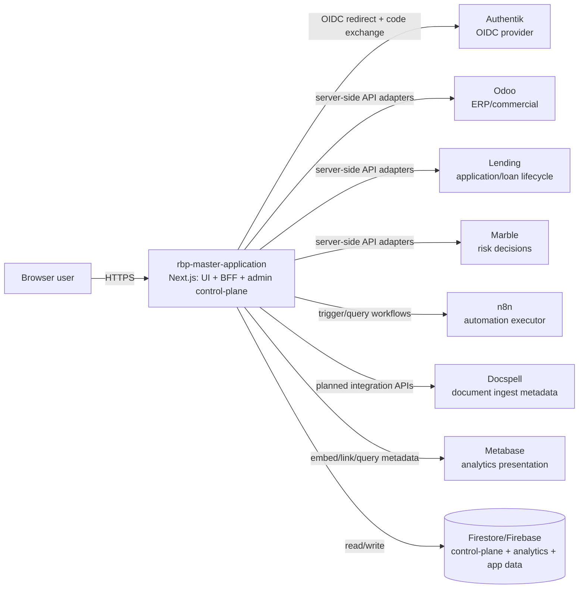

# Deployment topology (Phase A / Step 1)

## Decision for `rbp-master-application`

`rbp-master-application` is formally treated as **frontend + BFF + control-plane admin** in one deployable Next.js runtime.

It is **not** frontend-only: the repository owns authenticated API routes, platform session brokering, integration adapters, workflow orchestration, feature controls, and admin APIs. This is visible across `src/app/api/**`, `src/lib/bff/**`, `src/lib/platform/**`, and admin route policies. 

## Deployable units and where they run

| Deployable unit | Runs from this repo? | Runtime type | Recommended deployment target |
|---|---:|---|---|
| `rbp-master-application` | Yes | Next.js server runtime + web UI | Firebase App Hosting / managed container runtime |
| Authentik | No | Identity provider (OIDC) | Separate platform service (self-hosted or managed by identity platform team) |
| Odoo | No | ERP/commercial engine | Separate platform service (self-hosted VM/container cluster) |
| Lending (Frappe Lending) | No | Lending engine | Separate platform service (self-hosted VM/container cluster) |
| Marble | No | Risk/decision engine | Separate platform service (vendor-managed or dedicated service) |
| n8n | No | Workflow automation executor | Separate platform service (self-hosted container/K8s or managed n8n) |
| Docspell | No (planned integration) | Document ingest/metadata engine | Separate platform service |
| Metabase | No (planned integration) | Analytics presentation | Separate platform service |

## Runtime ownership inside this repository

### What gets deployed from `rbp-master-application`

1. Public-facing web application routes (`src/app/**`).
2. Auth/session endpoints and callback surfaces (`/api/auth/*`, `/api/session/*`).
3. BFF endpoints (`/api/dashboard`, `/api/tasks`, `/api/customers/:id/360`, etc.).
4. Control-plane admin UI and APIs (`/admin/**`, `/api/admin/**`).
5. Workflow orchestration APIs (`/api/workflows/**`) and internal orchestration state.
6. Feature/module/access policy evaluation runtime.
7. Firestore-backed control-plane and analytics writes.

### What does **not** get deployed from this repository

- Authentik runtime.
- Odoo runtime.
- Lending runtime.
- Marble runtime.
- n8n runtime.
- Docspell runtime.
- Metabase runtime.

This repo integrates with those services via API and protocol contracts; it does not host their engine processes.

## Request/response and event flow

## Synchronous dependencies (request-critical)

| Dependency | Why synchronous |
|---|---|
| Authentik | Login and callback exchange are request-path operations for authenticated sessions. |
| Odoo | BFF search/customer/invoice/ticket views rely on upstream reads in live mode. |
| Lending | Application/loan detail requests resolve in BFF request cycle in live mode. |
| Marble | Decision/risk reads and evaluation can be part of workflow/request processing in live mode. |
| Firestore/Firebase | Session/control-plane/analytics and app persistence are direct runtime dependencies. |

## Async/event dependencies (not always user-blocking)

| Dependency | Async role |
|---|---|
| n8n | Triggered as downstream automation executor from workflow steps; platform retains workflow state ownership. |
| Webhook providers (e.g., Square routes present in repo) | Inbound events drive updates/orchestration without direct page-load coupling. |
| Planned Docspell ingestion | Document ingestion/classification and metadata sync expected to be asynchronous-heavy. |

## Deployment model recommendation for Phase A

### Recommended topology

- Keep a **single deployable app** (`rbp-master-application`) for experience + BFF + control-plane.
- Keep all engines external as **separate platform services**.
- Force browser-to-engine access through BFF except explicit auth redirects and allowed embeds.

### Why this model is strongest for the current repo

- The repo already has integrated server APIs and orchestration (not pure SPA).
- Access/feature policies are enforced backend-first.
- Adapter boundaries are already explicit for Odoo/Lending/Marble/n8n.
- Admin/control-plane lives in same auth/session model and codebase.
