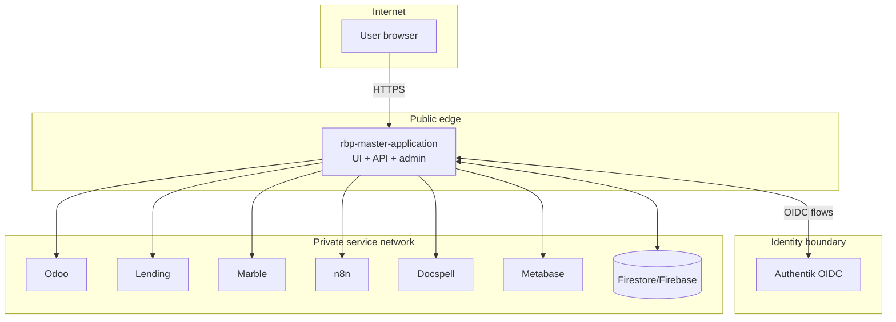

# Network and trust boundaries (Phase A / Step 1)

## Boundary model

## Internet-facing vs internal services

| Service | Internet-facing? | Access policy |
|---|---:|---|
| `rbp-master-application` web and API origin | Yes | Public routes, authenticated routes, and admin/internal routes all terminate here with app-level authorization. |
| Authentik OIDC endpoints | Yes (for browser redirects/login) | External auth endpoints exposed; admin interfaces should be IP/network restricted. |
| Odoo | No (target state) | Backend-only access from app integration layer. |
| Lending | No (target state) | Backend-only access from app integration layer. |
| Marble | No (target state) | Backend-only access from app integration layer. |
| n8n | No (except explicit webhook needs) | Backend-only API access; webhook endpoints narrowly exposed if unavoidable. |
| Docspell | No | Internal-only. |
| Metabase | No (or tightly scoped) | Internal/admin-only; external embed must use signed/app-mediated strategy. |
| Firestore/Firebase APIs | Managed cloud endpoint | Service-account/IAM + SDK mediated; not directly browser-writable for privileged collections. |

## Control-plane and admin-only boundaries

- `/admin/**` and `/api/admin/**` are treated as **internal control-plane surfaces** even if hosted on public origin.
- Admin access requires authenticated session + admin capabilities + module controls.
- Sensitive mutations (feature/module controls, membership/admin ops) remain backend-enforced.

## Auth/session boundary

- Authentik is authoritative for identity credentials and IdP session.
- `rbp-master-application` exchanges authorization code server-side and mints/maintains platform session cookies.
- Session cookies are HttpOnly and scoped to app origin.
- Tenant/workspace context switching is performed by app backend endpoints, not by client-side token manipulation.

## Secrets trust assumptions

| Secret class | Holder | Trust assumption |
|---|---|---|
| OIDC client secret + session secret | `rbp-master-application` runtime secret store | Never exposed to browser; rotated by platform ops. |
| Adapter credentials (Odoo/Lending/Marble/n8n) | `rbp-master-application` runtime | Server-side use only; least-privileged service accounts/API keys. |
| Firestore service account credentials | App runtime / managed identity | Access constrained by project + IAM roles. |
| Webhook verification secrets | App runtime + upstream sender | Required for inbound webhook authenticity checks. |

## Firestore/Firebase boundary

- Firestore is a platform data plane dependency for control-plane state and analytics/event records.
- Privileged control-plane collections (e.g., feature assignments/rollout/module rules) are backend-managed.
- Direct client writes to privileged control-plane collections are out-of-scope and should remain disallowed.
- Environment separation must use distinct Firebase projects (dev/stage/prod) to avoid cross-environment trust bleed.

## Communication modes by trust boundary

| Engine/service | Communication mode from app | Boundary type |
|---|---|---|
| Authentik | Auth redirect + OIDC callback + token exchange | Cross-boundary auth protocol |
| Odoo | BFF-mediated direct API | Internal service boundary |
| Lending | BFF-mediated direct API | Internal service boundary |
| Marble | BFF/workflow direct API | Internal service boundary |
| n8n | Event-driven orchestration trigger + status polling/webhooks | Internal automation boundary |
| Docspell | Planned backend API/events | Internal document boundary |
| Metabase | Embedded analytics and/or backend metadata fetch | Internal analytics boundary |

## Launch-scope tags

| Service | Tag |
|---|---|
| `rbp-master-application`, Authentik, Odoo, Lending, Marble, Firestore | Launch-critical |
| n8n | Internal-only accelerator (upgrade to critical when automation-heavy flows are mandatory) |
| Docspell, Metabase | Optional later-phase modules |
